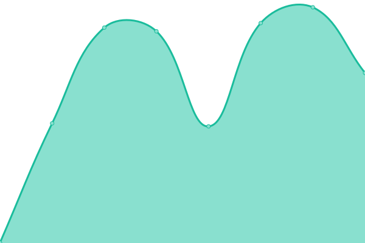

# [📈 Live Status](https://ClanersLoera.github.io/monit): <!--live status--> **🟧 Partial outage**

This repository contains the open-source uptime monitor and status page for [ClanersLoera](https://ClanersLoera.github.io/monit), powered by [Upptime](https://github.com/upptime/upptime).

With [Upptime](https://upptime.js.org), you can get your own unlimited and free uptime monitor and status page, powered entirely by a GitHub repository. We use [Issues](https://github.com/ClanersLoera/monit/issues) as incident reports, [Actions](https://github.com/ClanersLoera/monit/actions) as uptime monitors, and [Pages](https://ClanersLoera.github.io/monit) for the status page.

<!--start: status pages-->
<!-- This summary is generated by Upptime (https://github.com/upptime/upptime) -->
<!-- Do not edit this manually, your changes will be overwritten -->
<!-- prettier-ignore -->
| URL | Status | History | Response Time | Uptime |
| --- | ------ | ------- | ------------- | ------ |
|  [Claners](https://www.claners.com) | 🟩 Up | [claners.yml](https://github.com/ClanersLoera/monit/commits/HEAD/history/claners.yml) | 

 444ms
     
 | 

<a href="https://https://clanersloera.github.io/monit//history/claners">100.00%</a>
    

|  [CoppelDigital](https://www.coppeldigital.com) | 🟥 Down | [coppel-digital.yml](https://github.com/ClanersLoera/monit/commits/HEAD/history/coppel-digital.yml) | 

 73ms
     
 | 

<a href="https://https://clanersloera.github.io/monit//history/coppel-digital">0.03%</a>
    

|  [API](https://www.api.claners.com) | 🟥 Down | [api.yml](https://github.com/ClanersLoera/monit/commits/HEAD/history/api.yml) | 

 0ms
     
 | 

<a href="https://https://clanersloera.github.io/monit//history/api">8.62%</a>
    

<!--end: status pages-->

[**Visit our status website →**](https://ClanersLoera.github.io/monit)

## 📄 License

- Powered by: [Upptime](https://github.com/upptime/upptime)
- Code: [MIT](./LICENSE) © [ClanersLoera](https://ClanersLoera.github.io/monit)
- Data in the `./history` directory: [Open Database License](https://opendatacommons.org/licenses/odbl/1-0/)
